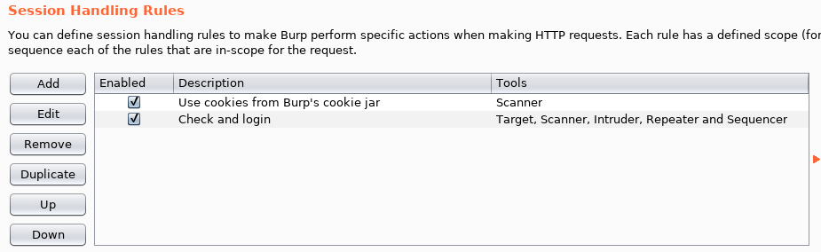
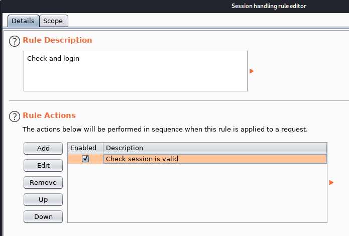
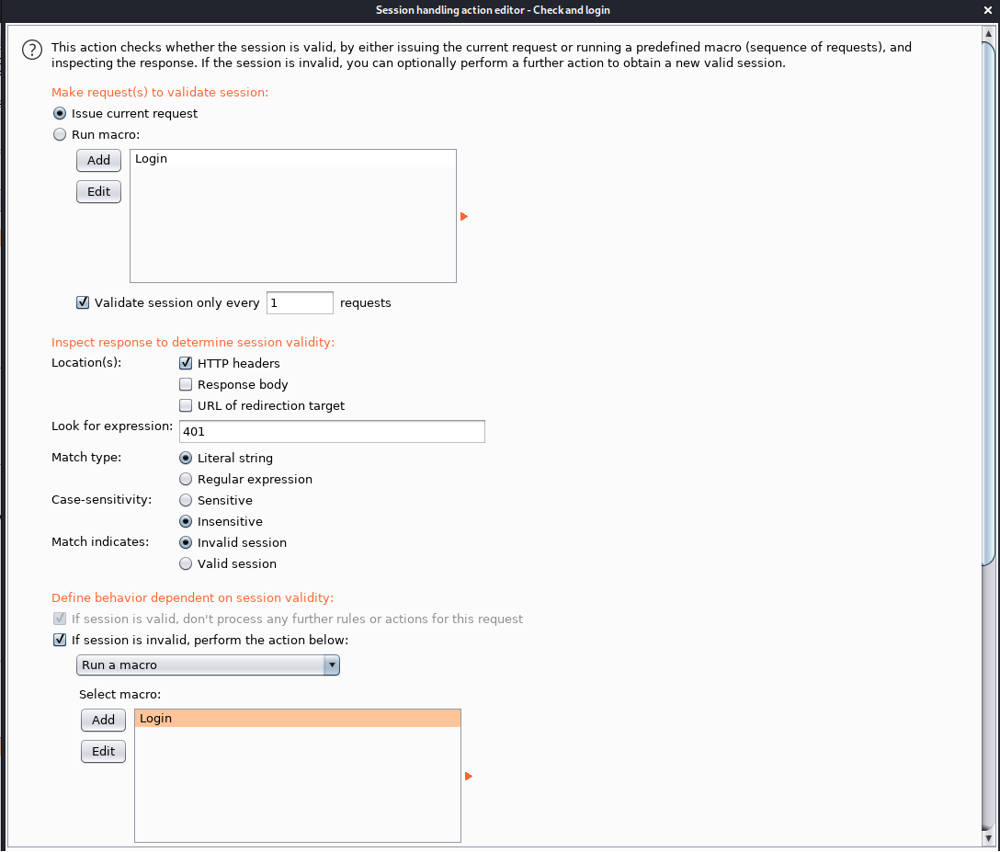
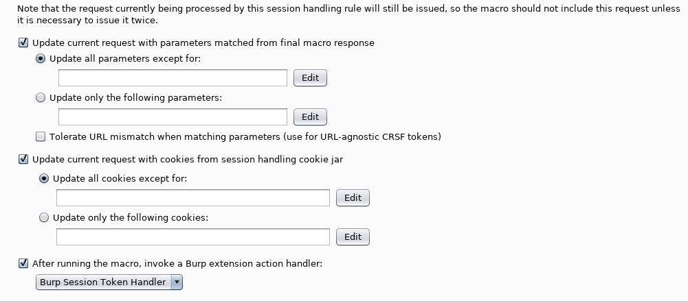

# Burp Session-Token Handler extension

Originally from https://www.twelvesec.com/2017/05/05/authorization-token-manipulation/
Updated to be a little more SOLID.

Retrieves a 'token' value from JSON response and uses that in ensuing x-access-token requests

See the instructions at twelvesec or https://www.gracefulsecurity.com/burp-macros-re-authentication/ for how to integrate it into your session checking

## Configuration

